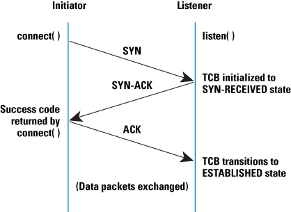
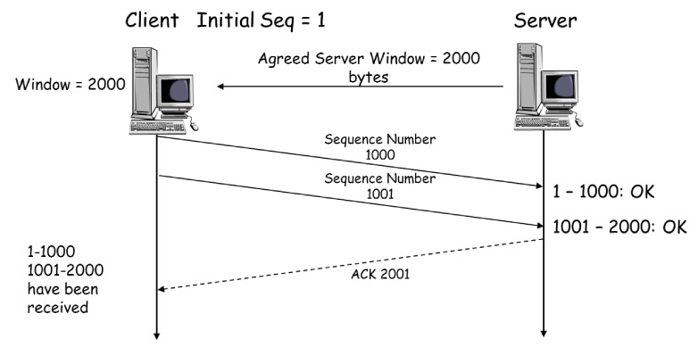

# Lecture 12 - TCP / IP Security

> 왜.. TCP/IP 설계할때 이런걸 고려안했어?  ~~그니까 말이야.. xx~~  
>
> 그땐 인터넷이 지금보다 믿을만한 곳이었다고 합니다..

## ✅ 사전 지식 체크 ✅

### TCP/IP

#### TCP/IP

- 🔗 인터넷 프로토콜 IP (인터넷 프로토콜)
  - 네트워크 통신 규약
- 🔗 전송 조절 프로토콜 TCP (전송 제어 프로토콜)
  - 데이터를 보내는데 보내는 데이터의 순서, 빠진 부분 들을 관리하며 채워넣어주는 등 제어 기능

#### 3️⃣-way handshake

3️⃣-way handshake는 TCP 연결을 위해 이용되는 방법.

1. 출발지 => **SYN 번호** => 목적지
2. 목적지 => **ACK (= SYN + 1) with new SYN** => 출발지
3. 출발지 => **new ACK (= SYN + 1)** => 목적지

>📓 **용어 사전** 📓
>
>**SYN** : Sequence Number - 랜덤 값
>
>**ACK** : Acknowledgement - 데이터가 출발지에서 목적지까지 제대로 전달되었는지 확인하는 메세지 

#### Windowing

---

## 🔒 Security in Network 🔒

### 1. Threat Model

- ⚠️ Intercept /modify network packet or inject packet
  - 전송되는 패킷을 열어봐서 source, destination 에게 임의의 데이터(공격자가 원하는 데이터)를 전송시킬 수 있음. 
    최근에 신뢰하지 못하는 패킷에 대한 필터링 기능이 조금 생겼지만 완전히 믿을만 한 기능은 아니라고 함.
  - 임의의 데이터를 보내는게 왜 위험해?
    - 오버플로우 공격 가능
- ❌ Attacker has full control of 내 컴퓨터
- 🔥 participate in protocols
  - 프로토콜 디자인 등에 참여하면서 문제점이 있는 구조를 설계 & 이용할 수 있음
  - trigger bugs in some implementation
    - 큰 implementation 일수록 디자인 수정, 변경 등이 어렵다는 점을 이용

### 2. TCP Seq number Attack

> TCP handshake 에 2가지 문제가 있다고?!@ 😳😳

#### Handshake 과정 🤝

--- 연결 ㄴㄴ ---

- **Client** : Client => SYN(SNc) => Server
- **Server** : Server => SYN(SNs), ACK(SNc + 1) => Client
- **Client** : Client => ACK(SNs + 1) => Server

--- 연결 완료 ---

- **Client** : Client => Data(SNc), ACK(SNs) => Server

>📓 **용어 사전** 📓
>
>**SNc** : Sequence Number from Client - client 로부터 전송되는 seq number
>
>**SNs** : Sequence Number from Server - server 로부터 전송되는 seq number

#### Server는 어떻게 실제 Client에서 보낸 데이터라는걸 알 수 있을까?

SYN이 추측하기 어려운 값이기 때문에

추측이 어렵지만 만약 공격자가 SNs를 알게 된다면, 공격자는 server와 연결을 맺을 수 있음

#### 공격자는 어떻게 SNs를 알 수 있을까?

--- 연결 ㄴㄴ ---

- **Client** : Client => SYN(SNc) => Server
- **Server** : Server => SYN(SNs), ACK(SNc + 1) => Client
- **Client** : Client => ACK(SNs + 1) => Server **<<<<<<<<<<<<<<<<<<< 취약한 지점. 예측 EASY~** 

--- 연결 완료 ---

- **Client** : Client => Data(SNc), ACK(SNs) => Server

**TCP 는 *모든 연결* 에 대해 완전히 랜덤한 SYN을 전송하지 않는다. 일정 시간동안 특정한 비율로 증가시켜가며 생성 & 전송.** 공격자는 이 부분을 취약점으로 보고 SYN 패턴을 알아내는 방법으로 SNs를 알아낼 수 있다. 

#### **공격 방법** 🔪

> **A** - 공격자 (C의 IP 주소를 알고 있음)
>
> **D** - 목표
>
> **C** - D가 신뢰하는 client

1. A는 B가 만들어내는 SYN(ISN) 패턴을 알아낼 필요가 있다.
   1. 많은 양의 연결을 B에게 보내서 B가 만들어내는 ISN의 패턴을 알아낸다
2. A는 C의 IP로 B에게 연결을 요청한다.
3. B는 연결 요쳥에 대해 응답으로 C에게 SYN/ACK를 보낸다
   1. C는 연결 요청을 B에게 한 적 없기 때문에 RST(Reset) 패킷을 B에게 보낸다.
   2. 연결 실패 (😱😱😱 ??)
4. 3-1이 그대로 실행되면 연결에 실패하므로 A는 TCP SYN flooding 공격을 통해 C의 목적 포트(?)의 큐를 가득차게 해서 B로부터 들어오는 요청을 수행할 수 없도록 만든다 (Like DDos 공격)
   (Even if that RST was sent, adversary could try to race before RST arrives.)

5. 👻 모든 준비는 끝났다! 👻
   이제 A는 B의 ISN의 패턴을 알고 있으며, 또한 B와 신뢰 관계에 있는 C의 기능을 마비시켰다. 
   1. A는 C의 IP 주소로 B로 연결을 요청한다. 
   2. B는 C에 SYN/ACK를 보내게 된다. 
   3. BUT!!!!!!! C는 이미 큐가 차서 이 패킷을 그냥 버리게 된다. 
   4. A는 B가 보내는 SYN/ACK 패킷의 값을 알아낸 패턴으로 계산한다. 
   5. A는 다시 C의 IP 주소로 B에 TCP 연결 과정의 3번째 단계인 ACK(SNs + 1)를 보낸다. 
   6. B는 받은 ACK 값이 자신의 보낸 SYN + 1과 같다면 연결을 성사시킨다. 👏👏👏

> 🤔 그럼 TCP는 왜 완전 랜덤값을 만들지 않는가? 🤔
>
> - Subtle interactions with reused connections (src/dst port numbers).
> - Want to avoid old packets (from past conns) interfering with new conn
> - 나머진 함께 알아보쟈 ^^

>📓 **용어 사전** 📓
>
>**ISN** : Initialize Sequence Number - SYN 중 초기 연결을 위한 seq number을 지칭

####  Problem #1 - IP Based authorization

- ID/PW 방식 인증이 아닌, IP를 신뢰하는 인증방식에서 취약점을 보인다. ex) rlogin, rsh, rcp
  - 물론 r-command 방식은 현재 ssh 를 더 많이 사용하게 되어서 사장되어가는 구조
- SMTP

#### Problem #2 - RST Attack

- Router 의 TCP connect를 끊어서 traffic 이슈를 발생시킬 수 있음. 
  - ex) BGP 라우터사이 연결 끊기
- Solutions:
  - TTL hack (255. 8bit)
    - 바로 직전 라우터로부터 오지 않은 패킷은 Reject 하는 것
    - TTL 값을 이용해서 TTL이 255이상이면 패킷 Reject
  - MD5 header authentication (very specialized for router-to-router links)

#### Problem #3 - Data injection & hijack

>📓 **용어 사전** 📓
>
>**Spoof** : (사전) 패러디. 속이다 ...
>
>**rlogin** : 원격 접속, 두 시스템 간 신뢰관계를 맺으면 암호 없이 로그인 할 수 있다.
>
>**rsh** : rlogin처럼 사용할 수 있고 신뢰관계를 맺으면 로그인하지 안호 원격시스템에 명령을 실행 할 수 있다.
>
>**rcp** : 원격지의 파일과 디렉터리를 복사해 오거나 내 시스템의 파일과 디렉터리를 복사해줄 수 있다. 
>
>**BGP** : Border Gateway Protocol. AS내부, AS끼리 연결을 담당하는 프로토콜
>
>**AS** : Autonomous System. 네트워크 자율 시스템. 특정 지역을 관할하는 거대 네트워크 관리기관을 두는 것.
>
>**TTL** : Time To Live. 네트워크에서 패킷이 존재할 수 있는 최대 시간. Infinity loop를 막기 위해 존재. 8bit.

### 3. TCP SYN Implementation

TCP SYN 을 유추할 수 있는 문제를 어떻게 해결할 수 있을까?

#### Nice Trick 🤩

**_ISN = ISN_old_style + F(src ip, src port, dst ip, dst port, secret key)_**

- F is some pseudo-random function; roughly, think SHA1
- Requires no extra state to keep track of per-connection ISNs.
- secret key 는 방금전 공격처럼 해커가 source의 IP, port 를 알고있을 때를 대비

### 4. DNS Attack

TCP 는 위와같은 트릭으로 공격에 대응할 수 있게 되었지만 DNS는 아직 취약점이 많다.

DNS는 UDP 기반에서 동작

#### Problem #1 - Fake Response 를 만들기 쉽다

- dest IP, port는 정해져 있고, 연결이 없기 때문에 seq number도 없는 상황
- 공격자가 클라이언트에게 face response를 줄 수 있음
  - Why? 🙄 ( 잘 모르겠어요.. )
  - DNS runs over UDP, no seq numbers, just ports, and dst port fixed (53).
  - If adversary knows client is making a query, can fake a response.
    - Just need to guess src port, often predictable.
- Solutions
  - Source Port number(16bits), Query ID(16bits) 을 랜덤하게 정한다.
    - 총 32bits 랜덤값이 되므로 완벽하진 않지만 매우 어려운 조합이 됨
    - Network level solution
  - DNSSEC
    - application level solution
    - 좋지만 문제점도 존재한다. 
      - 'no such name' response에서 sign 문제
        - NSEC3 을 통해 부분적으로 문제해결 가능
        - (추측🙄) DNSSEC은 DNS에 이름이 없으면 비슷한? 다음? 이름을 주는 구조인가봐

>📓 **용어 사전** 📓
>
>**DNS** : Domain Name System. 도메인 이름을 IP로, IP를 도메인 이름으로 바꿔주는 시스템
>
>**UDP** : User Datagram Protocol. TCP 와 마찬가지로 데이터 전송 프로토콜. 
>
>- TCP는 연결 지향성인 반면 UDP는 연결을 강제하지 않는다. 
>- 각 패킷별로 목적지가 있으면 보내주기만 하는 것 (사이에서 로드밸런싱만 해준다). 
>- 속도는 TCP보다 빠르지만 연결이 없기 때문에 안정성은 낮고, 데이터 전송을 보장해주진 않는다.
>- DNS, 스트리밍 서비스에서 주로 사용

### 5. SYN Flooding

#### SYN Flooding

- TCP 연결에서 2번-3번 단계를 보면, server가 패킷을 보내고 (SYN, ACK), 다시 client로부터 ACK를 기다리는 시간이 있었다. 
  - called a half-open connection

- 만약 위에 과정을 유도하는? SYN 메세지가 과도하게 들어온다면?
  - 계속 half-open connection 을 만들어내게 되고
  - 결국 메모리가 부족해서 이후 연결들에 대해서는 연결을 reject하게 된다.

- 이런걸 SYN Flooding Attack라고 한다.

- solution
  - 3단계에서 ACK를 받기 전까지 서버를 stateless하게 만들면 됌!
    - make the server stateless, until it receives that third packet (ACK).
    - 근데 어려움 💢
  - Encode server-side state into sequence number.
    - ***ISNs = F(src ip, src port, dst ip, dst port, timestamp, <u>KEY</u>) || timestamp***
    - **이렇게 전송하고 서버에서는 상태값을 가지지 않음. KEY가 어느 곳에도 공개되지 않은 서버만의 고유 키이므로 해당 키가 존재하는 ISN이 있는 client 의 연결만 허용** 🤩
    - 뒤에 *|| timestamp* 를 통해 RST, 이전 연결 요청등을 판단가능

