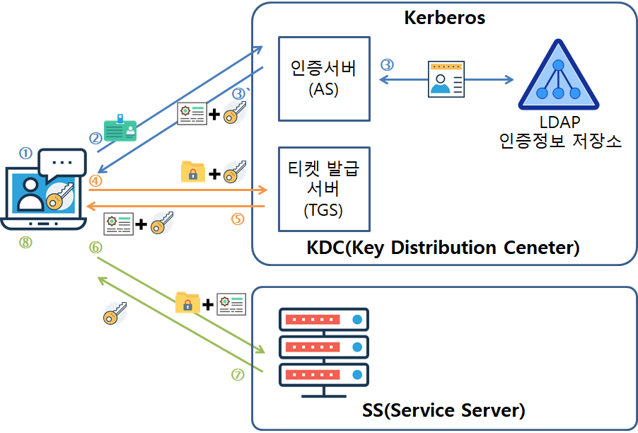
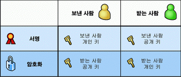
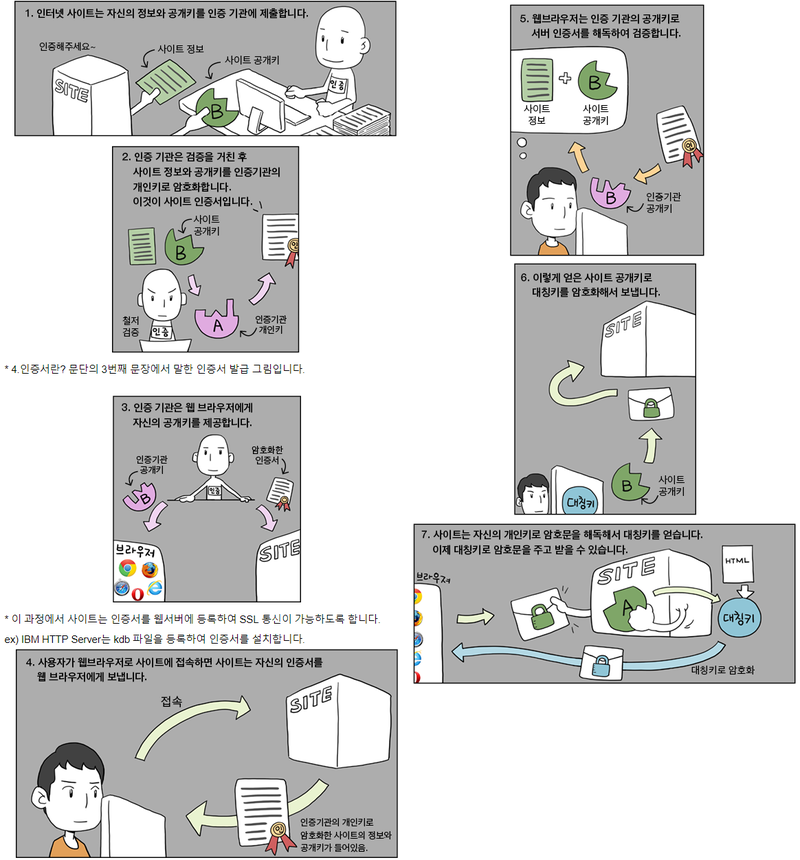

# SSL and HTTPS

### 지난 시간 (간단하게)복습 - Kerberos


#### 구성요소

- 클라이언트 : 인증을 얻기 위한 사용자/컴퓨터
- 서버 : 클라이언트가 접속하고자 하는 곳
- KDC(Key Distribution Center) : 사용자 검증, 사용자와 TGS 사이에 사용될 세션 키 발급
- 티겟 발급 서버 (TGS) : 서버 접속에 사용할 수 있는 티켓을 클라이언트에게 발급


#### 인증 과정

- 클라이언트는 인증 서버(KDC)로 부터 인증을 받음
- 인증이 완료되면 KDC는 클라이언트가 TGS로 부터 티켓을 받을 수 있도록 허락
- 클라이언트는 TGS로부터 받은 티켓을 이용해 서버에 접속
- 서버를 클라이언트가 보낸 티켓을 검증

---

### SSL 와 HTTPS 란?

- HTTP : 데이터(HTML)을 전송하기 위한 통신규약
- HTTPS (HypterText Transfer Protocol + Secure) : 보안아 강화된 HTTP
- SSL (Secure Socket Layer) : 인터넷 보안 프로콜
- SSL은 HTTSP 보다 포괄적인 의미이다 = HTTPS는 SSL 프로토콜 위에 돌아가는 프로토콜
- (e.g. 웹=HTTPS, 인터넷=SSL)


### Kerberos로 충분하지 않은 이유는?

- 모든 사람이 단 하나의 KDC 를 신뢰하는 것이 가능?
- 전세계 사람들의 key를 관리한다는게 가능? 또 모든 사람들이 kerberos에 계정을 가지고 있는 것도 아님
- 서버 접속할때마다 KDC에 요청? -> performance bottleneck

> 이러한 문제를 해결할 수 있는 것이 **공개키 암호화** 방식 (비대칭키)


### 대칭키 vs 비대칭키

- **대칭키** : 암호화와 복호화에 똑같은 키가 이용됨
- **비대칭키** : 암호화와 복호화에 각각 다른 키가 이용됨 (public key, secret key)
    - 안전하게 메세지 전송 가능
        - B가 A에 메세지를 전달하고 싶으면, A의 공개키를 구해서 그걸로 암호화 함
        - A의 개인키로만 복호화 가능하기 때문에 오직 A만이 확인 가능
    - 본인임을 인증하기 위해서도 사용됨 (전자서명))
        - A가 본인의 비밀키로 메세지 암호화 한 다음 B에게 전송
        - B가 A의 공개키로 메세지를 복호화 
        - 복호화가 된다면, 그것은 메세지를 보낸 사람이 A라는 것을 검증
    - 단, 속도가 많이 느림. 그래서 긴 문서를 암호화는데에는 잘 안씀
    - 대칭키 값을 주고 받아야 할 떄, 그것을 암호화하기 위해 이용됨




### 만약 서로의 공개키를 모른다면? + 인증과정

- CA (Certificate Authority) : 인증서를 발급하는 역할을 함
- Certificate : CA의 비밀키로 사이트의 공개키를 전자서명과 함께 암호화 한것
    - CA의 공개키로만 복호화 가능
    - **서버 개인키를 보증**하기 위해 그 쌍이 되는 사이트의 공개키가 인증서에 포함되어 있음

> 사이트와 웹 브라우저로 예시를 살펴보자

1. 사이트는 자신의 정보와 공개키를 CA에 제출
2. CA는 받은 정보와 공개키를 CA의 개인키로 암호화 함 -> 인증서 생성
3. 사용자가 웹 브라우저를 통해 특정 사이트 방문 시, 사이트는 본인의 인증서 제출  ("야, 나 괜찮은 애야.")
4. 웹 브라우저는 CA의 공개키를 통해 인증서를 복화함 -> 검증과정 ("자기 인증서 맞나? 이 CA에서 발급 받은거 맞아?")
5. 복호화가 되면 방문고자 하는 사이트의 공개키를 GET 
6. 이후의 소통에 사용될 **대칭키** 를 사이트의 공개키로 암호화 한 다음에 사이트에게 전송 ("너가 맞다면, 이 메세지 해독할 수 있지? 대칭키 알아내서 그걸로 나랑 통신하자")
7. 사이트는 받은 메세지를 보인의 개인키로 복호화 함 -> 대칭키 GET ("ㅇㅇ 대칭키 알아냄. 이걸로 통신하자")

> **🔥🔥헷갈리지 않기🔥🔥 SSL은, 인증과정에서는 비대칭키를, 통신할때는 대칭키를 이용한다!!**
> 1. 비대칭키 : 인증. 통신에 이용할 대칭키를 암호화 할 때 이용
> 2. 대칭키 : 통신할 때 이용. 이 대칭키를 이용하여 서로 주고받는 메세지를 암호화 하는 것




### 인증서의 문제점

- Kerberos를 이용할 때에는, 사람들이 한 대의 KDC만 믿으면 됨. 근데 인증서를 이용하려면 결국 수백개의 CA를 신뢰해야함. ?!!
- 인증서의 유효기간은 몇달, 몇년 단위로 상대적으로 김.(kerberos의 ticket 수명은 몇시간 정도)
    - 문제가 생겨도 즉각적인 대응이 어려움
    - Good for Scalability, Bad for Security
- 그냥 CA가 인증서를 잘못 발핼할 수도 있음. 실수로...
- 인증서 폐지 과정이 까다로움


### 인증서 폐지 과정 및 관리

- CRL (Certification Revocation List)
    - 클라이언트들은 CRL을 주기적으로 다운받아야 함. 근데 list 너무 거대해..좋은 생각이 아니야
    - CA들은 번거롭게 CRL을 업데이트 하지 않아...
- OCSP (Onlince Certificae Status Protocol)
    - 인증서의 만료/폐지 여부를 CA DB에 직접 요청하는 방법. CRL과 같은 목록을 다운받을 필요 x
    - 이것도 별로임. 매번 물어봐야 해 -> latency
    - OCSP 서버가 다운되면 아무것도 못해
    - Attacker가 만료된 인증서를 가지고 있을 때, client가 OSCP와 통신하지 못하도록 막기만 하면 됨. 그럼 클라이언트가 "어? 물어볼 데가 없네. 그냥 내가 인증할께 ㄱㄱ"

> 여기에 대한 완벽한 해결책은 없음. 실제로 크롬은 직접 리스트를 관리한다고 함 (매번 업데이트)
> 특정 CA가 Trusted list 에서 제외될 경우, 해당 CA에서 인증서를 받았던 멀쩡한 사이트, 유저들까지 피해를 입음..문제ㅠㅠ


### 그럼에도 불구하고 인증서 is better than Kerberos

- 하나의 거대한 KDC를 유지할 필요 x, 여러 군데로 분산 가능 -> scalable
- 양쪽 다 인증할 필요 x
    - 내가 네이버를 방문할 때, 나의 브라우저는 네이버를 인증하지만 네이버는 내가 누군지도 모름 (로그인 하기 전까지는)
    - Kerberos는 양쪽 다 인증이 필요함 + DB에 계정이 생성되어있어야만 함


--- 


### 브라우저에서 보호해야 할 3가지 ###
1. 데이터 
2. Anything that's running on 브라우저 (e.g. 코드, 쿠키)
3. UI 


### 데이터 보호 ###

- SSL 과 같은 보안 프로토콜 이용하여 암호화 하면 됨


### UI ###
- 대부분의 데이터는 유저로부터 발생함. 유저가 웹사이트에 무언가를 입력 및 전송하는 그 순간
- 보통 동시에 여러개의 창을 띄어놓기 때문에, 내가 지금 어디에 무엇을 입력중인지 상기시켜줘야 할 필요가 있음
- HTTPS 의 경우 보통 자물쇠 아이콘을 표시하기는 한데, 이거는 그냥 따라하면 그만임...
- Best Solution? 그런건 없다


### 코드 보호 ###

- 암호화로 보호받지 못한 코드는 attacker에 의해 악용될 여지가 많음
- 이거를 방지하기 위해 도입된 새로운 url scheme 이 HTTPS 
- Same origin policy
    - http 와 https 는 다른 origin 임
    - 브라우저가 https://foo.com/ 에 접속하자고 할 때, 정확히 이에 대한 인증서를 보여줘야 함.아니면 certificate mismatch 발생
    - non-HTTPS 페이지는 HTTPS 페이지에 간섭할 수 없게 됨
- DNS 취약점은 어떻게 극복해?
    - Attacker 가 DNS를 조작해서, 원래 클라이언트가 접속하고자 했던 서버인 척 한다고 해보자
    - 원래 서버의 비밀키를 모르는 이상, 통신은 이루어지지 않을것 (인증 x)
- Mixed content (HTTP + HTTPS)
    - 사이트에서 https를 지원하는데 중간에 로딩되는 코드 중 일부(javascript)가 http로, 암호화 연결이 안된 채로 전달되는 경우가 있음 (중요한 편지를 보내는데 일부가 밀봉이 안된 느낌)
    - 그래서 크롬에서도 차단을 하는 것 (http://blog.naver.com/cr0sscert/221813787506)
    - 해결방법) 페이지 안의 모든 contents 들도 secure 한지 확인 및 수정
        - e.g. ```<script src=”http://jquery.com”>```  --->  ```<script src=”https://jquery.com”>``` or ```<script src=”//jquery.com”>```


### 쿠키 보호 ###

- **seucre flag** 라는 게 있음
- secure flag 를 가지고 있으면 HTTPS로 통신하는 경우에만, 브라우저가 쿠키를 서버로 보낼 수 있음
- secure flag 가 없으면 HTTPS, HTTP 모두 가능
    - 왜 이렇게 이상하게 되어 있음? 그냥 HTTP 따로, HTTPS 따로 안되나?
    - 역사적인 이유 때문에 그렇다고 합니다...

> **secure flag는 매우 중요하다**

- 유저가 성실하게 HTTPS url에만 접속한다는 보장이 있어?
- 그렇다고 해도, attacker 가 유저에게 링크를 보낼 수도 있고, non-HTTPS url로부터 무언가를 다운받도록 유도할 수도 있음 
    - 이런 경우 **secure flag가 없는 쿠키들은 다 attacker의 서버로 전송되어버릴것**
    - e.g. 어떤 사이트에 접속했는데, http:// 로부터 이미지 로드해버림. 광고 같은거. 막을 방법이 없어
    - 처음부터 차단해 버려야 함. 