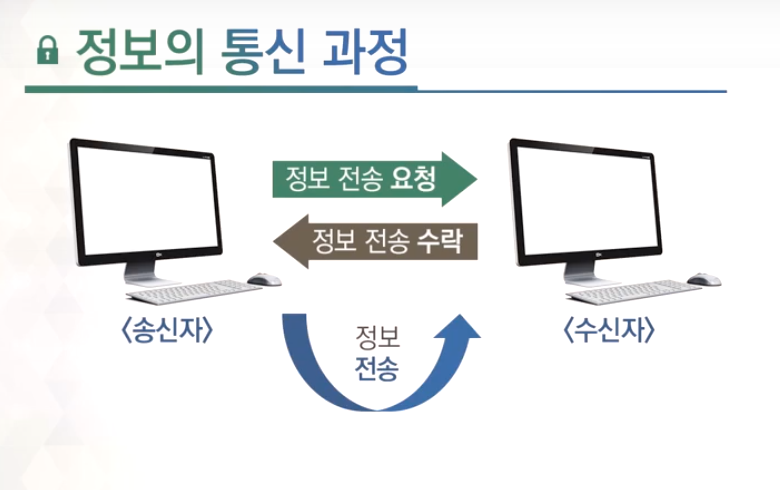
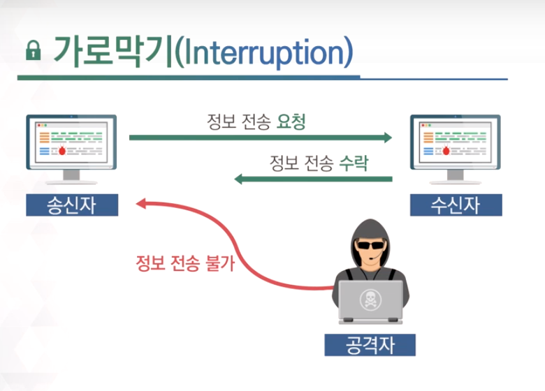
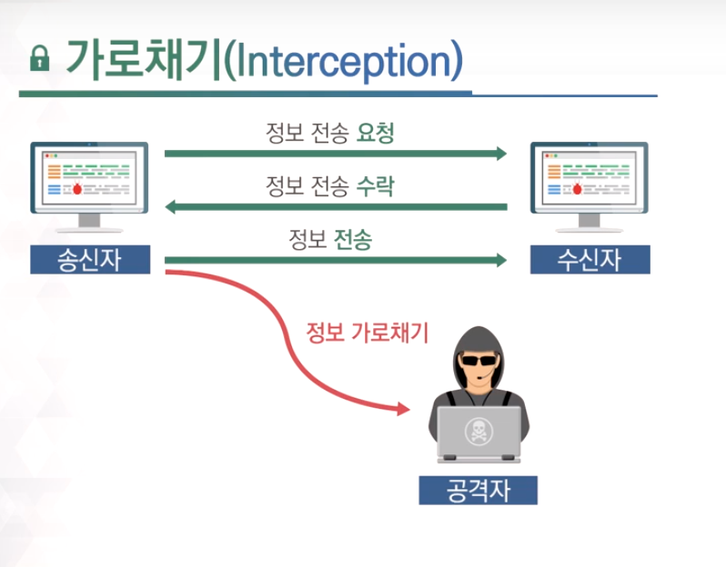
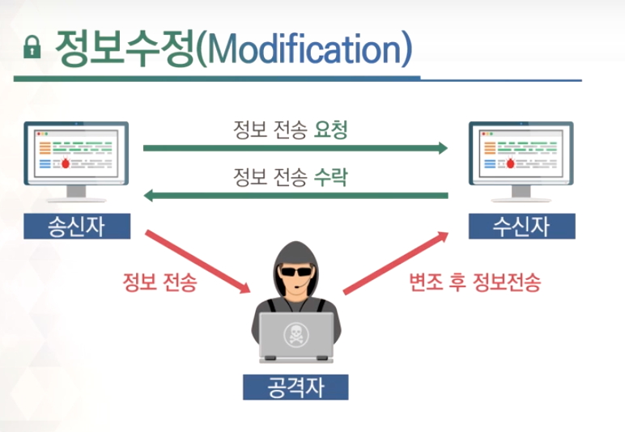
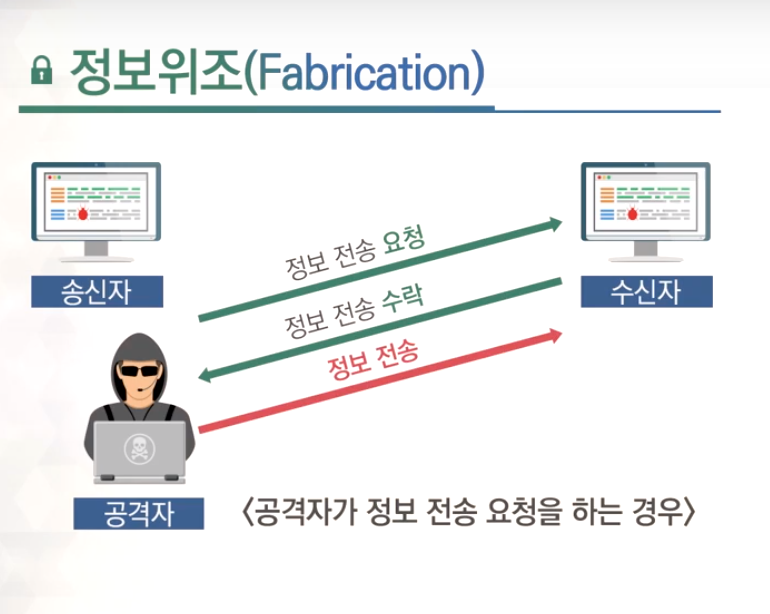

# 1. 정보보호 및 컴퓨터 보안 개념

## 1.1 정보보호개론 소개

### 보안

- 자산의 본래 가치가 손상되지 않도록 내/외부의 각종 위협으로부터 자산을 적절한 방법으로 보호하는 것

### 정보보호 (Information Security)

- 의도적, 비의도적(실수 및 사고) 변조, 파괴, 서비스 지체 등 "불법적 노출로부터 정보를 보호하는 것"

### 정보보안의 기본 3대 요소 (목표)

- 기밀성 (Confidentiality)
- 무결성 (Integrity)
- 가용성 (Availability)

### 기밀성 (Confidentiality)

- 인가된(Authorized) 사용자만 정보자산에 대한 접근을 허용하는 것

- 일기장이 자산이라면, 일기장을 누군가가 훔쳐본 경우 기밀성이 깨졌다고 말할 수 있다.

- 위협요소
  - 도청
  - 도난
- "무언가를 지킨다"는 일반적인 보안의 의미와 가장 가깝다.

### 무결성 (Integrity)

- 데이터가 악의적으로 변경되지 않는 것
  - 자산이 **인가된 당사자**에 의해 **인가된 방법**으로 변경이 가능한 것

- 내 메신저의 대화명을 누군가 임의로 원하지 않는 대화명으로 변경한 경우 무결성이 깨졌다고 말할 수 있다.

### 가용성 (Availability)

- **인가된 당사자**가 **원하는 시간**에 데이터에 접근 가능한 것
  
- 원하는 시간에 원하는 서비스나 데이터가 제공되지 못하면 **가용성의 문제**가 발생한 것
  
- 해커의 공격으로 은행 서비스 이용이 불가능한 경우, 가용성이 깨졌다고 말할 수 있다.

- 위협요소

  - 내부요소: DDoS 공격 등

    시스템을 악의적으로 공격해 해당 시스템의 자원을 부족하게 하여 원래 의도된 용도로 사용하지 못하게 하는 공격

    [Dos, DDos](https://ghdwn0217.tistory.com/88)

  - 외부요소: 화재, 정전 등

- 뛰어난 가용성의 예
  
  - 24시간 편의점: 원하는 시간에 언제든 이용이 가능

### 정보보안을 위한 추가요소

- 책임의 추적성
- 인증
- 접근제어(접근 권한)

### 인증

- 데이터나 서비스 이용을 위해 신분을 식별하는 행위

- 예
  - 신분증
  - id와 password
  - 지문, 홍채 인식

### 책임추적성

- 모든 행동에 대한 기록과 주체에 대한 추적을 제공하는 것

- 누군가 내 집의 물건을 훔쳐갔는데 아무런 증거도 찾을 수 없다면 책임의 추적성이 깨진 것
- 예
  - 로그 등의 기록 남기기

### 접근제어

- 데이터나 서비스 이용에 대한 허가 또는 거부를 할 수 있는 기능
- 인가된 사용자만이 데이터나 서비스에 접근할 수 있도록 하는 장치
- 군사기밀에 해당하는 정보를 비문(비밀문서) 분류를 하지 않아서 누구나 1급 기밀에 접근이 가능하다면 안될 것

## 1.2 보안 위협의 유형

- 보안 취약점의 정의

- 보안 위협 요소 및 유형

- 최근의 보안 위협 동향

### 보안 위협(Threat)

- 화산, 지진, 홍수 등의 자연재해
- 사전 지식이 없는 사용자에 의한 사고
- 테러리스트, 산업스파이 등

### 보안 취약점(Vulnerability)

- 보안의 취약점이 보안 위협으로 이어진다
- 위협에 사용될 수 있는 **자산 내 약점**
- **안전 장치의 부재 또는 미비**를 의미

- 예
  - 자물쇠가 고장난 문
  - 최신 엔진으로 업데이트되지 않은 백신 소프트웨어

### 보안 위협 요소 및 유형

### 정보의 통신 과정

- 정상적인 정보의 통신 과정
  - 송신자의 정보 전송 요청
  - 수신자의 정보 전송 수락
  - 송신자의 정보 전송

### 정보 통신 과정의 보안 위협 예

1. 가로막기
2. 가로채기
3. 정보의 수정
4. 정보의 위협

### 가로막기 (Interruption)

- 출발지로부터의 정보가 특정 이유로 분실되거나 목적지에 도착하지 못하는 경우
- 가용성(Availability)의 위협
- 예
  - 하드디스크의 파괴, 통신회선의 절단, 파일관리 시스템의 무력화 등

### 가로채기 (Interception)

- 특수 장비 등을 이용하여 제 3자가 중간에 정보를 가로채는 경우

- 기밀성(Confidentiality)에 대한 위협

  

### 정보수정 (Modification)

- 제 3자가 송신된 정보를 변조 후 전송함으로써, 정보의 일관성을 침해하는 위험
- 무결성(Integrity)에 대한 위협
- 자산의 부당한 변경

### 정보위조 (Fabrication)

- 허가 받지 않은 사용자가 올바르지 못한 정보를 전송하거나, 시스템에 위조된 정보를 보내는 경우
- 사용자 인증과 관계해서 마치 다른 송신자에게 데이터가 온 것처럼 꾸미는 것
- 무결성(Integrity)에 대한 위협
- 통신망에서 가짜 메시지를 삽입하는 경우나 파일에 가짜 레코드를 추가하는 경우가 여기에 해당
- 유사한 시스템처럼 행동하는 경우

[참고](https://spoemeo.tistory.com/entry/%EC%A0%95%EB%B3%B4%EB%B3%B4%EC%95%88-%EA%B0%9C%EB%85%90-%EC%95%8C%EA%B3%A0%EA%B0%80%EA%B8%B0)

[참고2](http://a24s.com/data/jeongbotongsinhakseub/jbgs/book/chp5/chp5-3.htm)

### 최신 보안 위협 동향

- 분산화
  - 여러 개의 PC를 활용해서 공격
- 소셜 공학
  - 사람의 심리, 감정, 느낌, 기억 등(소셜 네트워크를 통해 얻을 수 있는 정보들) 인간의 취약점을 이용한 공격의 증가
- 스마트폰
  - 악성 앱의 급증 (개인정보 유출 등)

### 보안 위협 동향에 맞추어 준비할 사항

- 방어 메커니즘, 방어 기법 연구/개발

## 1.3 정보보호 조금 더 알아보기

- 보안의 분야

- 보안에 실패하는 이유

### 보안의 분야

- 시스템 보안
  - 컴퓨터 시스템(os 포함)의 취약성을 이용한 공격으로부터 자산을 보호
  - 계정관리, 세션관리, 권한관리(access, read 등) 등
- 네트워크 보안
  - 네트워크 프로토콜의 취약성을 이용한 공격으로부터 자산 보호
  - 분산공격, 세션 하이재킹, 디도스 공격, 스푸핑 공격
- 물리적 보안
  - 컴퓨터 및 정보 시스템을 화재, 파괴, 지진 등 물리적 위험으로부터 보호
  - 시설관리, 직원 보안교육, CCTV 침입탐지 등
- 모바일 보안
  - 모바일 운영체제의 불안정성, 이동성으로 인한 문제점 등으로부터 개인 정보 보호
  - 최근들어 중요성이 크게 부각됨
  - 버퍼 오버 플로우, 악성 앱 탐지

### 보안에 실패하는 이유

- 모든 것들을 해결해 줄 수 있는 보안 솔루션을 만드는 것이 어려운 이유

1. 복잡성
   - 복잡한 시스템
   - 보안의 가장 큰 위험 요소
   - 모든 시스템에는 버그와 오류가 내재되어 있으며, 이것은 취약점으로 연결된다.
   - 복잡도 증가 시 보안 버그 내재도도 함께 증가함

2. 공격자

   - 다양한 목적의 공격자(해커) 존재
     - 장난, 절도, 사기, 감시, 테러 등
     - 예) 스크립트 키디: 보안 및 공격에 대한 이해 없이 악성 스크립트를 다운받아 공격하는 케이스
     - 예) 해커: 보안 취약점을 공격하여 정보 탈취

3. 인적 요인

   - 많은 보안 문제가 사람의 책임에 의해 발생
     - 엉성한 절차, 보안성 체크 무시 등
     - 예) 퇴사자가 퇴사 후에도 회사 정보에 접근 가능한 경우

   - 보안성보다 사용성, 시스템 성능을 우선시하여 시스템을 선택하기 때문에

4. 투자

   - 보안에 대한 투자 우선순위가 상대적으로 낮음

   - 경제적 인센티브가 보안에 많은 영향을 미치기 때문

     - 대중들이 신기능, 새로운 디바이스에 열광

     - 선점효과(조기 소프트웨어 배포)를 위해 보안 희생

       